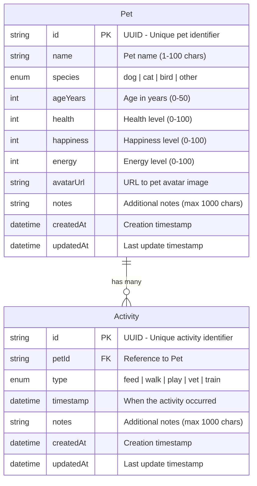
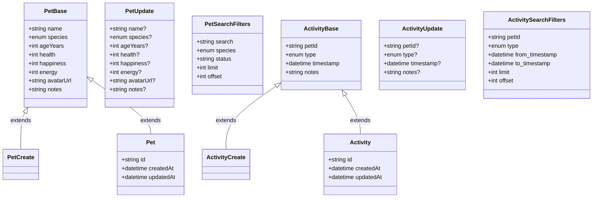

# PetPal MicroHack Challenges

## 🔐 Challenge 01: Access and Identity
Ensure access to the GitHub Organization and explore identity management options including Enterprise Managed Users and Azure AD federation. Establish proper access controls and create your own repository from the MicroHack template.

## ✨ Challenge 02: GitHub Spark Introduction & Prototype
Use GitHub Spark to rapidly create a PetPal frontend prototype using natural language prompts. Build a UI concept with navigation for Pets, Activities, and Accessories following brand guidelines with dark mode support.

## ☁️ Challenge 03: GitHub Codespaces Development Environment
Set up and customize a cloud-based development environment using GitHub Codespaces for the PetPal application. Learn how development environments can be defined as code for consistent onboarding across teams.

## 🧠 Challenge 04: Brainstorming with AI & Project Management
Create a GitHub Copilot Space as a knowledge base and brainstorm new product features using AI. Transform ideas into GitHub Issues and plan your product roadmap with intelligent assistance.

## 🚀 Challenge 05: GitHub Copilot – From Enabled to Effective
Master GitHub Copilot's capabilities including model selection, codebase search, and documentation generation. Learn to use web search, MCP tools, and custom instructions for maximum productivity.

## 📋 Challenge 06: Design a New Microservice with Copilot
Prepare technical specifications for the new accessory-service microservice using Copilot. Create API references, data models, deployment configs, and security documentation following established templates.

## 🛠️ Challenge 07: Implementation and Testing
Implement and test the PetPal application starting with existing services and then coding the new accessory service. Run the Cosmos DB emulator locally and verify all backend microservices work correctly.

## 🏗️ Challenge 08: Infrastructure as Code - Azure Deployment
Deploy PetPal microservices to Azure using Bicep for Infrastructure as Code. Provision Container Apps, Cosmos DB, and Azure Container Registry with proper resource organization.

## ⚙️ Challenge 09: Deployment Automation using GitHub Actions
Build a complete CI/CD pipeline for containerized microservices using GitHub Actions. Automate Docker builds, image pushes to ACR, and deployments to Azure Container Apps.

## 🔒 Challenge 10: Approval Processes and DevSecOps
Implement pull request policies with Copilot Code Review and branch protection rules. Add automated testing, code quality scanning, and deployment approval workflows for pre-production environments.

## 🤖 Challenge 11: Automating Minor Tasks with Copilot Agents
Create and run GitHub Copilot agent tasks to generate up-to-date API documentation. Learn to scope tasks, monitor agent progress, and review generated outputs for the Accessory Service.

## 🔭 Challenge 12: Operational Tasks with SRE Agent (Optional)
Explore AI-assisted Site Reliability Engineering for troubleshooting and monitoring scenarios. Implement intelligent alerting, automated incident response, and predictive operations with AI assistance.

---

# Backend Environment Variables

The following environment variables are used to configure the backend services (Pet Service and Activity Service):

| Variable | Required | Default | Description |
|----------|----------|---------|-------------|
| `COSMOS_ENDPOINT` | ✅ Yes | - | Azure Cosmos DB endpoint URL. Use `http://localhost:8081/` for local emulator or your Azure Cosmos DB URI for production. |
| `COSMOS_KEY` | ⚠️ Local only | - | Cosmos DB access key. Required for local development with emulator; Azure deployments use Managed Identity instead. |
| `COSMOS_DATABASE_NAME` | No | `petservice` / `activityservice` | Name of the Cosmos DB database. Each service has its own default. |
| `COSMOS_CONTAINER_NAME` | No | `pets` / `activities` | Name of the Cosmos DB container (collection). Each service has its own default. |
| `COSMOS_EMULATOR_DISABLE_SSL_VERIFY` | No | `false` | Set to `true` to disable SSL certificate verification when using the Cosmos DB emulator with HTTPS. |
| `DEBUG` | No | `false` | Enable debug mode for additional logging and diagnostics. |
| `APP_NAME` | No | Service-specific | Display name for the application (used in API docs). |
| `APP_VERSION` | No | `1.0.0` | Application version string. |
| `LOG_LEVEL` | No | `INFO` | Logging verbosity level (DEBUG, INFO, WARNING, ERROR). |

## Authentication Strategy

- **Local Development**: Uses key-based authentication with `COSMOS_KEY`
- **Azure Deployment**: Uses Entra ID (Managed Identity) via `DefaultAzureCredential` - no key required

---

# Data Models

The backend services use Pydantic models to define data schemas. Below is the entity relationship diagram showing the data model of our application.

## Class Diagram

## Enumerations

| Model | Field | Allowed Values |
|-------|-------|----------------|
| Pet | `species` | `dog`, `cat`, `bird`, `other` |
| Activity | `type` | `feed`, `walk`, `play`, `vet`, `train` |
