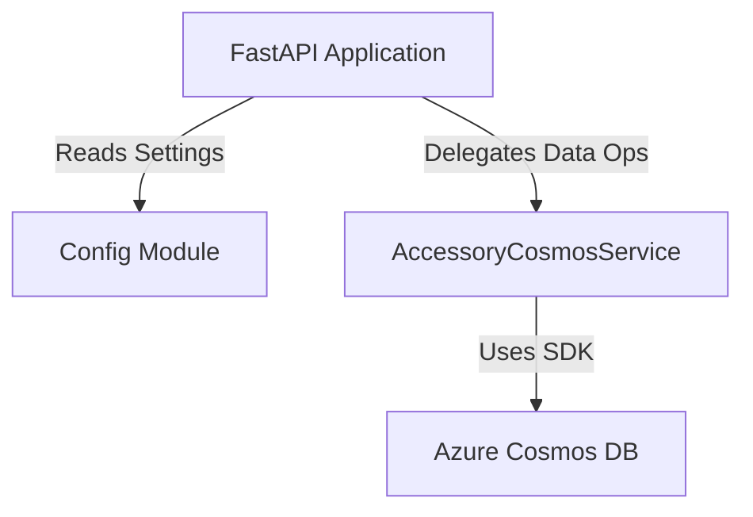

````markdown
# Service Architecture Snapshot

Provide a focused view of how this service fits into the broader system while inheriting global context from `../../platform/ARCHITECTURE.md`.

## Context
The **Accessory Service** manages pet accessories (toys, food, collars, bedding, grooming supplies, and other items). It provides CRUD operations for inventory management, supports filtering and search capabilities, and enables low-stock detection for proactive restocking workflows.

**Purpose:**
- Maintain a catalog of pet accessories with type, pricing, and stock information.
- Support discovery through filtering (by type, low stock) and text search.
- Enable admins and staff to manage inventory and identify items needing attention.

**Dependencies:**
-   **Upstream**: Frontend App (calls API).
-   **Downstream**: Azure Cosmos DB (stores data).

## Component Diagram



### Configuration Strategy
The service follows the same configuration pattern as the Pet Service and Activity Service:
1.  **Environment Variables**: Primary source of configuration.
2.  **Dotenv Support**: Loads `.env` files for local development.
3.  **Validation**: The `Settings` class ensures `COSMOS_ENDPOINT` is set.
4.  **Environment Detection**:
    -   **Local**: Detects `localhost` endpoint and expects `COSMOS_KEY`.
    -   **Azure**: Configured to use Managed Identity in production environments.

## Data Flow
1.  **Request**: HTTP Request hits FastAPI endpoint (e.g., `POST /api/accessories`).
2.  **Validation**: Pydantic models (`AccessoryCreate`) validate the payload structure and types.
3.  **Service Layer**: `AccessoryCosmosService` handles business logic, generating IDs and timestamps.
4.  **Persistence**: Data is written to the `accessories` container in Cosmos DB.
5.  **Response**: JSON response with the created/retrieved accessory.

### Search and Filter Flow
1.  **Query Parameters**: Frontend sends filter criteria (`search`, `type`, `lowStockOnly`, `limit`, `offset`).
2.  **Dynamic Query Building**: Service builds SQL query dynamically using a list-building pattern (no tautologies like `WHERE 1=1`).
3.  **Execution**: Query runs against Cosmos DB with `OFFSET` and `LIMIT` for pagination.
4.  **Ordering**: Results are ordered by `createdAt DESC`.

## Cross-Cutting Concerns

### Resilience
-   **Lazy Initialization Pattern**: Database connection is NOT established during `__init__()`. Connection occurs only when the first operation is attempted via `_ensure_initialized()`.
-   **Health Check with Auto-Setup**: If database or container doesn't exist during health check, they are created automatically with sample seed data (one toy and one food item with low stock).
-   **Error Handling**:
    -   `CosmosResourceNotFoundError` → 404 responses.
    -   `CosmosResourceExistsError` → Duplicate ID handling.
    -   All operations and errors are logged.

### Performance
-   **Server-Side Filtering**: All filtering (type, text search, low stock) happens in Cosmos DB queries to minimize data transfer.
-   **Pagination**: `OFFSET` and `LIMIT` support for handling large datasets.
-   **Async/Await**: Utilizes Python's `asyncio` for concurrent request handling.
-   **Caching**: `lru_cache` for configuration settings.

### Search Implementation Details
-   **Text Search**: Uses `CONTAINS()` function on `name` and `description` fields.
-   **Type Filter**: Exact match on `type` field.
-   **Low Stock Filter**: Items where `stock < 10`.
-   **Query Building**: Dynamic filter list building (NOT using `WHERE 1=1` tautologies due to Cosmos DB Emulator limitations).
-   **Ordering**: Results sorted by `createdAt DESC`.

## Decision References
-   **ADR-002**: Microservices architecture (Pet vs. Activity vs. Accessory) to allow independent scaling.
-   **Service-Specific**: Use of lazy initialization pattern for database resilience during startup.
-   **Service-Specific**: Low stock threshold of 10 items aligns with business requirement for proactive restocking.

````
